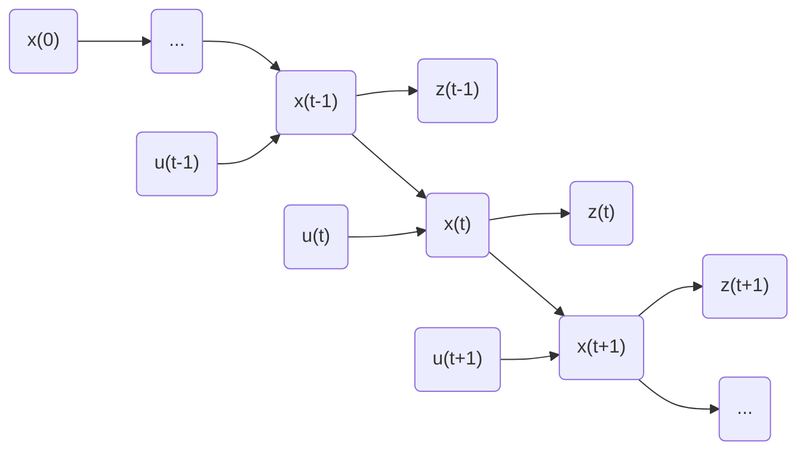

<!-- more -->

## 贝叶斯定理 Bayes Theorem

$$
p(x,z)=p(z\ |\ x)p(x)=p(x\ |\ z)p(z)
$$

$$
p(x\ |\ z)=\frac{p(z\ |\ x)p(x)}{p(z)}=\frac{liklihood*prior}{evidence}
$$

## 马尔可夫性质 Markov Property

- $x: state$ 
- $u: control\ signal$
- $z: measurement$

We want to use control signals and measurements from $1$ to $t$, to calculate the most possible state at time $t$, which is given by

$$
p(x_{t}\ |\ z_{1:t}, u_{1:t})
$$

Markov Assumption told us future state is conditionally independent of past states given the current state, which can be described by following equations:

<!-- - $p(x_{t+1}\ |\ x_{0:t})=p(x_{t+1}\ |\ x_{t})$ -->

- $p(z_t\ |\ x_t,z_{1:t-1},u_{1:t})=p(z_{t}\ |\ x_{t})$
- $p(x_t\ |\ x_{t-1},z_{1:t-1},u_{1:t})=p(x_{t}\ |\ x_{t-1},u_t)$

## 贝叶斯滤波 Bayes Filter

Our target is get the maximum probablity of $x_t$, when given $z_{1:t}$ and $u_{1:t}$, which is 

$$
p(x_{t}\ |\ z_{1:t}, u_{1:t})
$$

Apply Bayes Theorem to $p(x_{t}\ |\ z_{1:t}, u_{1:t})$, we get

$$
\begin{aligned}
&p(x_{t}\ |\ z_{1:t}, u_{1:t})\\\\=&\ p(x_{t}\ |\ z_t,z_{1:t-1}, u_{1:t})\\\\=&\ \frac{p(z_{t}\ |\ x_t,z_{1:t-1}, u_{1:t})p(x_{t}\ |\ z_{1:t-1}, u_{1:t})}{p(z_{t}\ |\ z_{1:t-1}, u_{1:t})}
\end{aligned}
$$

Apply Markov Assumption to $p(z_{t}\ |\ x_t, z_{1:t-1}, u_{1:t})$, we get $p(z_t\ |\ x_t,z_{1:t-1},u_{1:t})=p(z_{t}\ |\ x_{t})$

With Complete Probability Formula,

$$
p(z_{t}\ |\ z_{1:t-1}, u_{1:t})=\int p(x_t,z_{t}\ |\ z_{1:t-1}, u_{1:t}) {\rm d}x_t=\frac1\eta
$$

For $p(x_t\ |\ z_{1:t-1}, u_{1:t})$,

$$
\begin{aligned}
p(x_t\ |\ z_{1:t-1}, u_{1:t}) &= 
\int p(x_t, x_{t-1}\ |\ z_{1:t-1}, u_{1:t}) {\rm d}x_{t-1} \\
&= \int p(x_t\ |\ x_{t-1}, z_{1:t-1}, u_{1:t})\ p(x_{t-1}\ |\ z_{1:t-1}, u_{1:t}){\rm d}x_{t-1} \\
&= \int p(x_t\ |\ x_{t-1}, u_{t})\ p(x_{t-1}\ |\ z_{1:t-1}, u_{1:t-1}){\rm d}x_{t-1} \\
\end{aligned}
$$

Hence, the estimation of state $x_t$ is

$$
\begin{aligned}
&Bel(x_t)=p(x_t\ |\ z_{1:t}, u_{1:t})\\=&\ \eta\ p(z_t\ |\ x_t)\int p(x_t\ |\ x_{t-1}, u_{t})\ p(x_{t-1}\ |\ z_{1:t-1}, u_{1:t-1}){\rm d}x_{t-1}
\end{aligned}
$$

While $p(z_t\ |\ x_t)$ and $p(x_t\ |\ x_{t-1},u_t)$ is given by system model. Then the predict step and the update step is calculate $p(x_t\ |\ z_{1:t-1},u_{1:t})$ and $p(x_t\ |\ z_{1:t},u_{1:t})$.

## 实现方式 Realization

- Kalman Filters
- Particle Filters
- Hidden Markov Models
- Dynamic Bayesian Networks

## 参考资料 Reference

\[1\] S. Shen, “ELEC 3210 Introduction to Mobile Robotics Lecture,” HKUST.