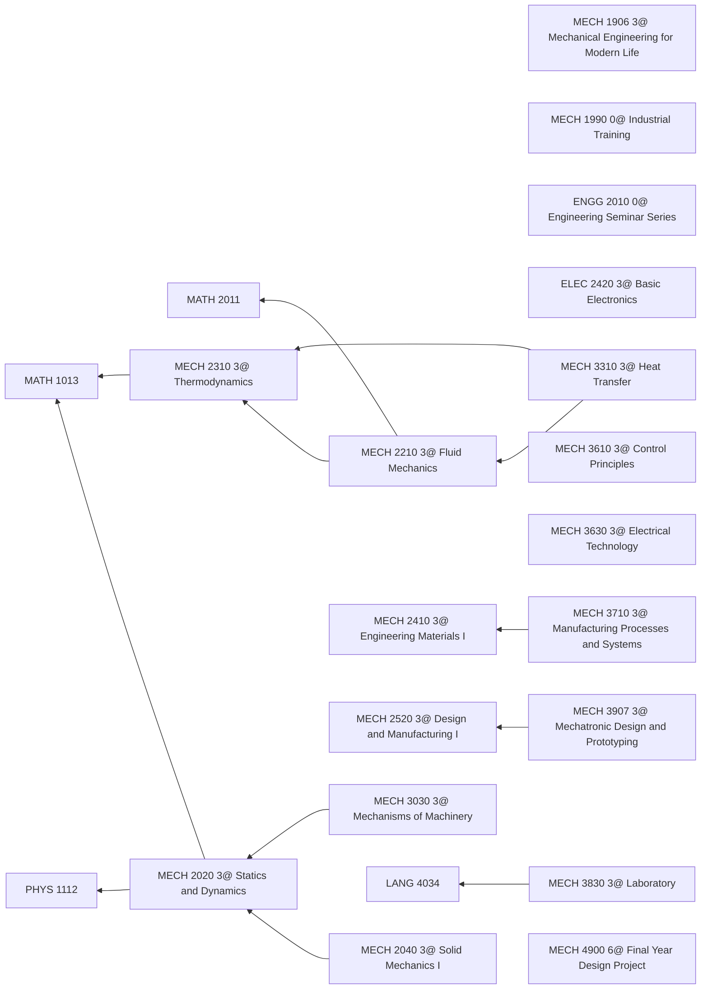
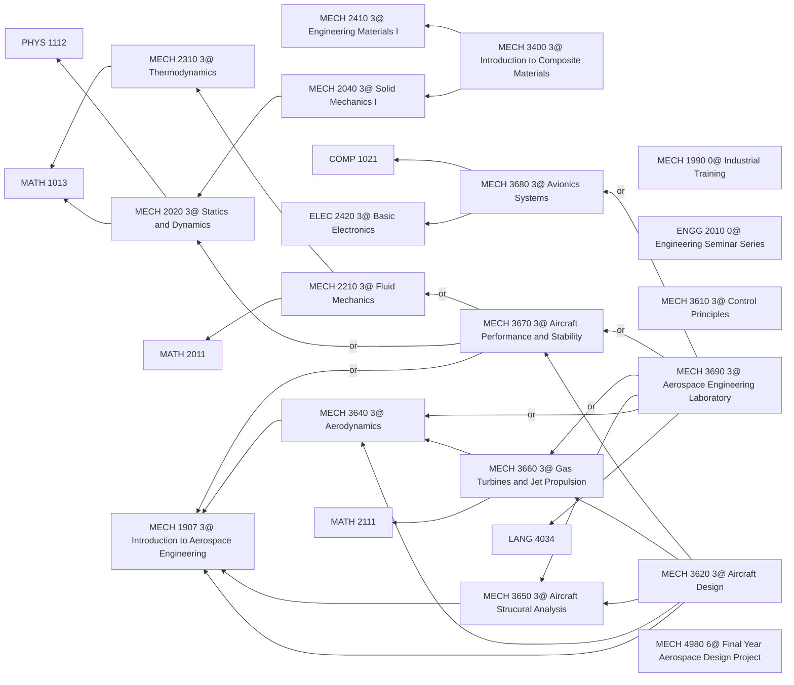

2024-25 入学机械工程及航天工程必修课的学习路径及机械课目录

<!-- more -->

## Mechanical Engineering



## Aerospace Engineering



## Courses

```
1902[MECH 1902 3@ Energy Systems in a Sustainable World];
1905[MECH 1905 3@ Buildings for Contemporary Living];
1906[MECH 1906 3@ Mechanical Engineering for Modern Life];
1907[MECH 1907 3@ Introduction to Aerospace Engineering];
1990[MECH 1990 0@ Industrial Training];
2020[MECH 2020 3@ Statics and Dynamics];
2040[MECH 2040 3@ Solid Mechanics I];
2210[MECH 2210 3@ Fluid Mechanics];
2310[MECH 2310 3@ Thermodynamics];
2410[MECH 2410 3@ Engineering Materials I];
2520[MECH 2520 3@ Design and Manufacturing I];
3030[MECH 3030 3@ Mechanisms of Machinery];
3110[MECH 3110 3@ Materials of Energy Technologies];
3300[MECH 3300 3@ Energy Conversion];
3310[MECH 3310 3@ Heat Transfer];
3400[MECH 3400 3@ Introduction to Composite Materials];
3420[MECH 3420 3@ Engineering Materials II];
3510[MECH 3510 3@ Computer-Aided Design and Manufacturing];
3610[MECH 3610 3@ Control Principles];
3620[MECH 3620 3@ Aircraft Design];
3630[MECH 3630 3@ Electrical Technology];
3640[MECH 3640 3@ Aerodynamics];
3650[MECH 3650 3@ Aircraft Strucural Analysis];
3660[MECH 3660 3@ Gas Turbines and Jet Propulsion];
3670[MECH 3670 3@ Aircraft Performance and Stability];
3680[MECH 3680 3@ Avionics Systems];
3690[MECH 3690 3@ Aerospace Engineering Laboratory];
3710[MECH 3710 3@ Manufacturing Processes and Systems];
3830[MECH 3830 3@ Laboratory];
3907[MECH 3907 3@ Mechatronic Design and Prototyping];
4000[MECH 4000 3@ Special Topics];
4010[MECH 4010 3@ Materials Failure in Mechanical Applications];
4100[MECH 4010 3@ Experiential Projects in Aerospace Engineering];
4340[MECH 4340 3@ Air Conditioning Systems];
4350[MECH 4350 3@ Indoor Air Quality in Buildings];
4360[MECH 4360 3@ Introduction to Intelligent Building Systems];
4430[MECH 4430 3@ Materials Charaterization];
4450[MECH 4450 3@ Introduction to Finite Element Analysis];
4710[MECH 4710 3@ Introduction to Robotics];
4720[MECH 4720 3@ Introduction to Precision Engineering];
4740[MECH 4740 3@ Numerical Methods in Engineering];
4750[MECH 4750 3@ Vibration, Control and Programming];
4810[MECH 4810 3@ Unmanned Aviation Vehicle];
4830[MECH 4830 3@ Introduction to Aerospace Computational Fluid Dynamics(CFD)];
4890[MECH 4890 3@ Introduction to Nanasatellite Engineering];
4900[MECH 4900 6@ Final Year Design Project];
4912[MECH 4912 3@ Green Technologies for Buildings, Energy and Water];
4950[MECH 4950 6@ Co-op Program];
4980[MECH 4980 6@ Final Year Aerospace Design Project];
4990[MECH 4990 6@ Aerospace Research Project];
4995[MECH 4995 6@ Research Project];
``` 