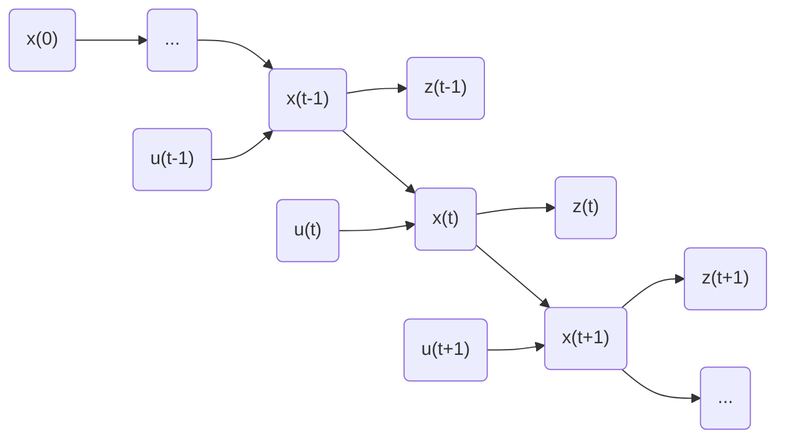

# Bayes Filter

We can use such a graph to understand the meaning of Bayes Filter. For a certain moment $t$, we apply a control $u_t$ to the system, drive the system's state from $x_{t-1}$ to $x_t$. And at this particular moment, we can only obtain the measurement $z_t$ rather than directly get $x_t$. So attemp to estimate the state of the system for given input and measurement is the purpose of Bayes Filter.

<!-- more -->

## Bayes Theorem

$$
P(x,z)=p(z|x)p(x)=p(x|z)p(z)\tag{1}
$$

Let $x$ denote the state of the system, $z$ denote the measurement of the system. Bayes Filter tends to estimate the belief of a certain state when given a measurement. Which is,

$$
p(x|z)=\frac{p(z|x)p(x)}{p(z)}=\frac{liklihood*prior}{evidence}\tag{2}
$$

In this clever way, the hard-to-obtain part $p(x|z)$ converts to an easier-obtain part $p(x|z)$. Because $p(x|z)$ is diagnostic, while $p(z|x)$ is causal.

## Markov Assumptions

In fact there is an important hidden assumption in the statement at the beginning. We assume that the current state depends only on the last single state, rather than all states from the beginning. Without the assumption, the problem should be modeled like this

$$
p(x_t|z_{1:t},u_{1:t})\tag{3}
$$

With Bayes Theorem, we can easily obtain the following form

$$
\begin{aligned}
&p(x_{t}|z_{1:t}, u_{1:t})\\\\=&p(x_{t}|z_t,z_{1:t-1}, u_{1:t})\\\\=&\frac{p(z_{t}|x_t,z_{1:t-1}, u_{1:t})p(x_{t}|z_{1:t-1}, u_{1:t})}{p(z_{t}|z_{1:t-1}, u_{1:t})}
\end{aligned}\tag{4}
$$

Then, apply Markov Assumption to $p(z_{t}|x_t, z_{1:t-1}, u_{1:t})$. Hypothetically but intuitively, if we are interested in measurement $z_t$, we only needs to know the state $x_t$, rather than other previous inputs or measurement. In mathematical,

$$
p(z_t|x_t,z_{1:t-1},u_{1:t})=p(z_{t}|x_{t})\tag{5}
$$

And for $p(z_t|z_{1:t-1},u_{1:t})$, $x_t$ doen't depend on $z_t$. Which means, for every $x_t$, the denominator is same. We can simply use a nominalizer $\frac1\eta$ to represent it. 

$$
\forall x_t,\ p(z_t|z_{1:t-1},u_{1:t})=\frac1\eta\tag{6}
$$

The rest part $p(x_t|z_{1:t-1},u_{1:t})$, with the Law of Total Probability

$$
\begin{aligned}
p(x_t|z_{1:t-1}, u_{1:t}) &= 
\int p(x_t, x_{t-1}|z_{1:t-1}, u_{1:t}) {\rm d}x_{t-1} \\
&= \int p(x_t|x_{t-1}, z_{1:t-1}, u_{1:t})p(x_{t-1}|z_{1:t-1}, u_{1:t}){\rm d}x_{t-1} \\
&= \int \underbrace{p(x_t|x_{t-1}, u_{t})}_{motion\ model}\underbrace{p(x_{t-1}|z_{1:t-1}, u_{1:t-1})}_{previous\ belief}{\rm d}x_{t-1} \\
\end{aligned}\tag{7}
$$

## Bayes Filter

We can now wrtie down all the expressions

### Prediction

Equation $7$ is the predict step of the Bayes Filter. When you only have an estimate of the previous state and the current input, predict what the current state should look like

$$
p(x_t|z_{1:t-1}, u_{1:t})=\int p(x_t|x_{t-1}, u_{t})p(x_{t-1}|z_{1:t-1}, u_{1:t-1}){\rm d}x_{t-1}\tag{8}
$$

### Update

After you do a predict, then you can put equations $5,6,8$ back to $4$. We are able to know where is the maximum belief of current state.

$$
p(x_t|z_{1:t},u_{1:t})=\eta p(z_t|x_t)p(x_t|z_{1:t-1},u_{1:t})\tag{9}
$$

However, in addition to initial state $x_0$, we are still not able to get $p(x_t|x_{t-1},u_t)$ and $p(z_t|x_t)$. But I would say, this is the essense of Bayes Filter. That is, as mentioned before, it makes the diagnostic part to be casual.

Starting from the second principle, for example, if we want to get $p(z_t|x_t)$. We can keep the system in a certain state, and continuously obtain the measurements from sensor. Then we are able to get the probablistic distribution. Or start from the first principle, we can use mathematics tools, such as state space model, to model the system.

## Reference

\[1\] S. Shen, “ELEC 3210 Introduction to Mobile Robotics Lecture,” HKUST.

\[2\] S. Thrun, W. Burgard, and D. Fox, “PROBABILISTIC ROBOTICS”.

