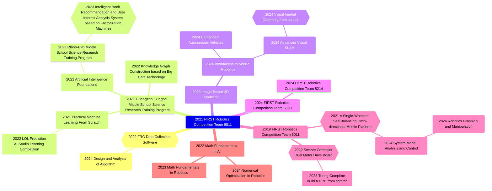
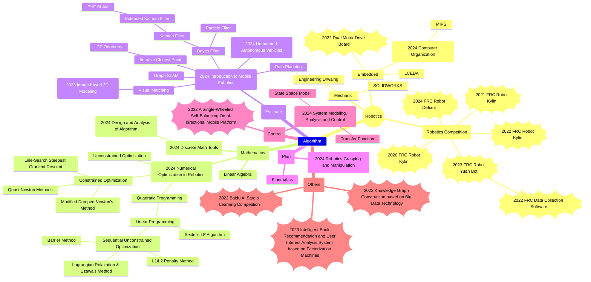

A continuously maintained blog that used to mark what I learned and what I do in my career.

<!-- more -->

<!-- 
  project: )) ((
  course: ) (
  experience: ( )
 -->




<!-- 
## Overview



## Timeline

```mermaid
timeline
  section High School
    2019 : ARDF
    2020 : FRC 2020 Robot<br>Kylin (8011)
    2021 : FRC 2021 Robot<br>Kylin (8011)
         : A Single-Wheeled Self-Balancing Omni-directional Mobile Platform
    2022 : FRC 2022 Robot<br>Yuan Bot (8811)
         : FRC 2022 Robot<br>Kylin (8011)
         : Guangzhou Yingcai Middle School Science Research Training Program
         : FRC Data Collection Software
         : Dual Motor Drive Board
    2023 : FRC 2023 Robot<br>Yuan Bot (8811)
         : Rhino-Bird Middle School Science Research Training Program
         : Image-Based 3D Modeling
    2024 : FRC 2024 Robot<br>Defiant (6399)
  section Undergraduate
    2024 Fall   : Part time<br>Next Innovation
                : Classic Control Theory
                : Introduction to Mobile Robotics
                : Numerical Optimization in Robotics
                : Robotics Grasping and Manipulation
                : Unmanned Autonomous Vehicles
    2025 Spring : Part time<br>Next Innovation
``` -->

