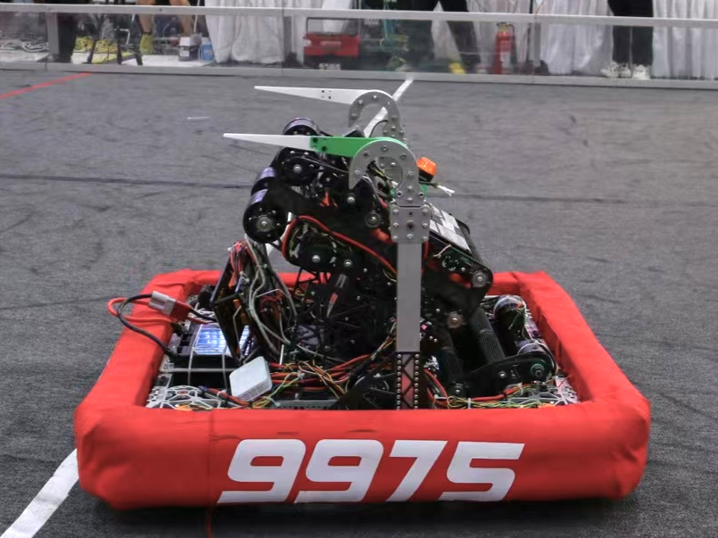
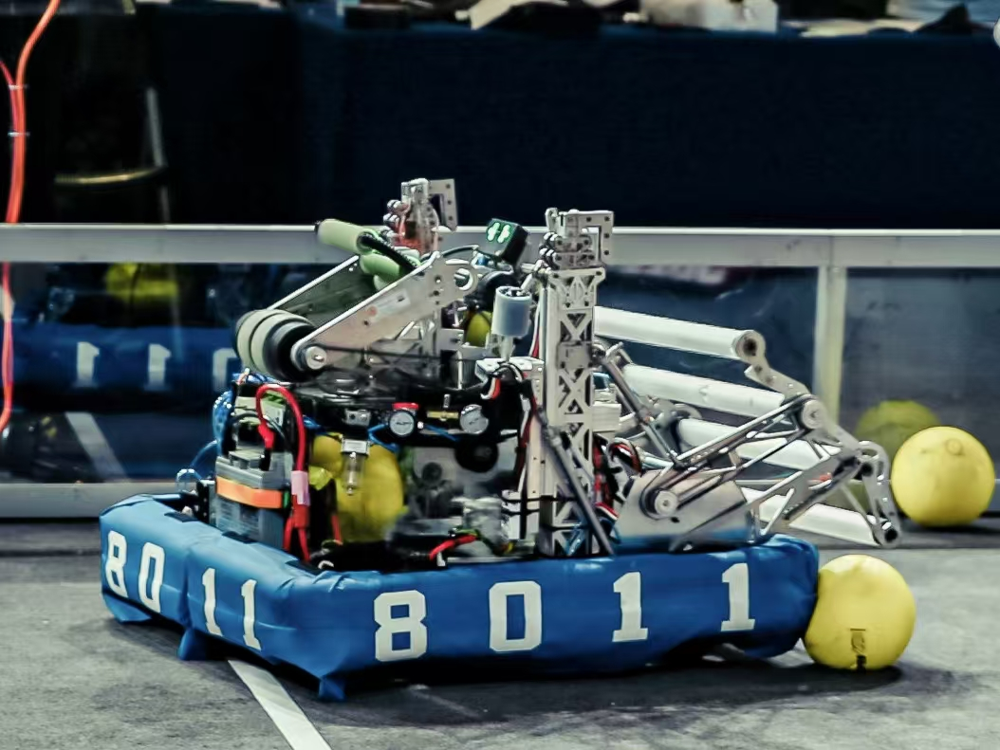
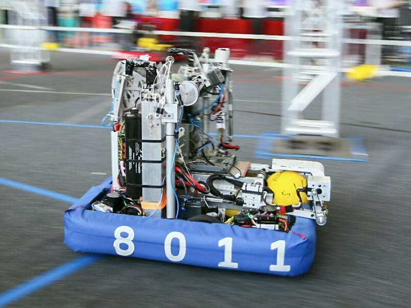
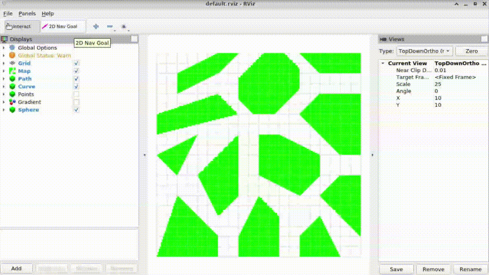

---
hide:
  - navigation
  - toc
---

# 

    

        <!-- <h2>Publications</h2> -->
        <h2>Projects</h2>
        

            

                <b class="academic-subtitle">
                    FRC 2025 Robot - TBA
                </b>
                

                    FIRST Robotics Competition Team 8214
                

                

                    *. 2025
                

                

                    <a href="https://www.youtube.com/watch?v=YWbxcjlY9JY">Background</a> /
                

                

                    
For FRC 2025 game rules, the mission of the robot is to place the coral, convey the algae, and hang on the cage.

                    
🔮 Mechanism-level Action Visualization

                    
👾 Custom Scouting App <a href="./#2024-cs">Cyber Scout</a>

                    
🕹️ Custom Node Selection Panel <a href="./#2025-cs">Cyber Selector</a>

                

                

                    
                    
                    
                    
                

            

            

                
            

        

            

                <b class="academic-subtitle">
                    FRC 2024 Robot - Defiant
                </b>
                

                    FIRST Robotics Competition Team 6399 (9975)
                

                

                    Jun. 2024 - Aug. 2024
                

                

                    <a href="https://www.youtube.com/watch?v=9keeDyFxzY4">Background</a> /
                    <a href="https://www.bilibili.com/video/BV1pbWCejEUi">Recap</a> /
                

                

                    
For FRC 2024 game rules, the mission of the robot is to collect the note and shoot to the speaker or to the amp.

                    
⚙️ AprilTag based VO and IMU Coupled Localization

                    
🏆 Engineering Inspiration Award <i>in 2024 FRC Off-season China</i>

                

                

                    
                    
                    
                

            

            

                
            

        

            

                <b class="academic-subtitle">
                    Intelligent Book Recommendation and User Interest Analysis System based on Factorization Machines
                </b>
                

                    2023 Rhino-Bird Middle School Science Research Training Program 
                    <b>Zirui Zhang</b>, Yue Peng 
                    Supervisor: Prof. Chuan Shi, BUPT
                    <!-- Beijing University of Posts and Telecommunications -->
                

                

                    Jun. 2023 - Oct. 2023
                

                

                    <a href="https://cloud.tencent.com/developer/article/2258040">Background</a> /
                    <a href="https://github.com/ZhangzrJerry/RhinoBird">Code</a> /
                

                

                    
The project aims to improve the accuracy and personalization of public library services.

                    
🏆 Excellent Award <i>in 2023 Rhino-Bird Program</i>

                

                

                    
                    
                            
                

            

            

                
            

        

            

                <b class="academic-subtitle">
                    FRC 2023 Robot - Yuan Bot
                </b>
                

                    FIRST Robotics Competition Team 8811
                

                

                    Jan. 2022 - Aug. 2023
                

                

                    <a href="https://www.youtube.com/watch?v=LgniEjI9cCM">Background</a> /
                    <a href="https://www.bilibili.com/video/BV1RW4y1M72Y">Recap</a> /
                

                

                    
For 2023 FRC Off-season China game rules, the mission of the robot is to collect and shoot the balls to the hub.

                    
🎯 Custom Scouting App <a href="./#2022-fdcs">FRC Data Collection Software</a>

                

                

                    
                    
                    
                

            

            

                
            

        

            

                <b class="academic-subtitle">
                    Balance Swerve: A Single-Wheeled Self-Balancing Omni-directional Mobile Platform
                </b>
                

                    FIRST Robotics Competition Team 8011 
                    Supervisor: Prof. Liang Chen, SCUT
                    <!-- South China University of Technology -->
                

                

                    Sep. 2021 - Mar. 2022
                

                

                    <a href="https://patents.google.com/patent/CN115107901A">Patent</a> /
                

                

                    
The platform is equipped with an omni-directional wheel and a balancing mechanism.

                    
🚠 Custom Dual Motor Drive Board <a href="./#2022-sc">Swerve Controller</a>

                

                

                    
                    
                    
                    
                

            

            

                
            

        

            

                <b class="academic-subtitle">
                    FRC 2022 Robot - Kylin
                </b>
                

                    FIRST Robotics Competition Team 8011
                

                

                    *. 2022
                

                

                    <a href="https://www.youtube.com/watch?v=LgniEjI9cCM">Background</a> /
                

                

                    
For FRC 2022 game rules, the mission of the robot is to collect and shoot the balls to the hub.

                    
🏆 Excellence in Engineering Award <i>in 2022 FRC Hangzhou Regional</i>

                

                

                    
                    
                    
                

            

            

                
            

        

            

                <b class="academic-subtitle">
                    FRC 2021 Robot - Kylin
                </b>
                

                    FIRST Robotics Competition Team 8011
                

                

                    *. 2021
                

                

                    <a href="https://www.youtube.com/watch?v=I77Dz9pfds4">Background</a> /
                    <a href="https://www.bilibili.com/video/BV1WQ4y1z7DM">Recap</a> /
                

                

                    
For FRC 2021 game rules, the mission of the robot is to collect the power cell and shoot to the power port.

                    
🏆 Rookie Game Changer Award <i>in 2021 INFINITE RECHARGE At Home Challenge</i>

                

                

                    
                    
                    
                

            

            

                
            

        

            

                <b class="academic-subtitle">
                    FRC 2020 Robot - Kylin
                </b>
                

                    FIRST Robotics Competition Team 8011
                

                

                    *. 2020
                

                

                    <a href="https://www.youtube.com/watch?v=gmiYWTmFRVE">Background</a> /
                

                

                    
For FRC 2020 game rules, the mission of the robot is to collect the power cell and shoot to the power port.

                    
🏆 Champion <i>in 2020 WE RoboStar Robotics League</i>

                

                

                    
                    
                    
                

            

            

                
            

        

    

        <h2>Full List</h2>
        

            

                <b class="academic-subtitle">
                    Cyber Selector: Custom Node Selection Panel
                </b>
                

                

                

                    Jan. 2025
                

                

                    <a href="../../img/projects/2025-cs-macaron.png">GUI (Macaron)</a> /
                    <a href="../../img/projects/2025-cs-high-contrast.png">GUI (High Contrast)</a> /
                

                

                Mainly responsible for GUI design and front end development.
                

                

                    
                    
                    
                

            

            

                
            

        

            

                <b class="academic-subtitle">
                    CoTiMo Planner
                </b>
                

                

                

                    Oct. 2024 - Nov. 2024
                

                

                    <a href="https://github.com/ZhangzrJerry/CoTiMo">Code</a> /
                    <a href="/blog/2024/11/24/cotimo">Blog</a> /
                

                

                    Collision-Free Smooth Path Generation, Time-Optimal Path Parameterization, and Model Predictive Control
                

                

                    
                    
                            
                

            

            

                
            

        

            

                <b class="academic-subtitle">
                    Cyber Scout
                </b>
                

                

                

                    Sep. 2024 - Feb. 2025
                

                

                

                

                    Mainly responsible for GUI design and Vue.js component development.
                

                

                    
                    
                    
                

            

            

                
            

        

            

                <b class="academic-subtitle">
                    Swerve Controller: Dual Motor Drive Board
                </b>
                

                

                

                    Sep. 2022 - Oct. 2022
                

                

                    <a href="../../img/projects/2022-sc-schematic.png">Schematic</a> /
                    <a href="../../img/projects/2022-sc-top.png">Layout</a> /
                    <a href="../../img/projects/2022-sc-bottom.png">Layout (bottom)</a> /
                

                

                    This drive board powers a swerve module with two independent motors: one for velocity, the other for steering, delivering a maximum power of 240W (2 * 12V * 10A).
                

                

                    
                    
                    
                

            

            

                
            

        

            

                <b class="academic-subtitle">
                    FRC Data Collection Software
                </b>
                

                    <b>Zirui Zhang</b>, Yue Peng
                

                

                    Mar. 2022 - Aug. 2022
                

                

                    <a href="https://github.com/zhangzrjerry/frc_scouting">Code</a> /
                    <a href="../../img/projects/2022-fdcs-gui.png">GUI</a> /
                

                

                    The wechat miniprogram provides a separate account for every team to collect, upload, browse, contrast, analyze, and export data during the FRC match.
                

                

                    
                    
                    
                

            

            

                
            

        

            

                <b class="academic-subtitle">
                    Knowledge Graph Construction
                </b>
                

                    2021 Guangzhou Yingcai Middle School Science Research Training Program 
                    Supervisor: Prof. Yi Cai, SCUT
                    <!-- South China University of Technology -->
                

                

                    Jan. 2022 - Aug. 2022
                

                

                    <a href="http://jyj.gz.gov.cn/gk/zfxxgkml/qt/gs/qt/content/post_7980438.html">Background</a> /
                

                

                    
                

            

            

                
            

        

    

