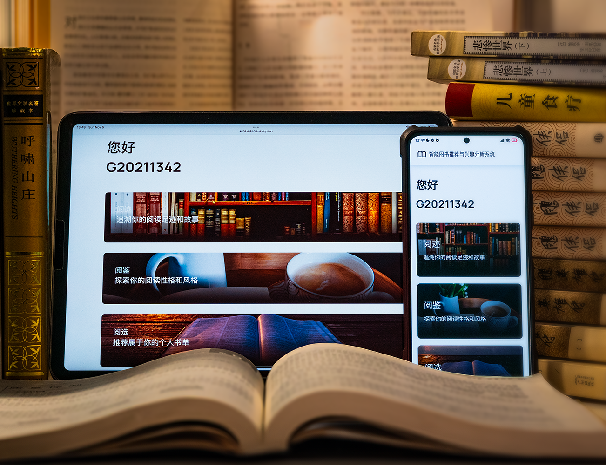
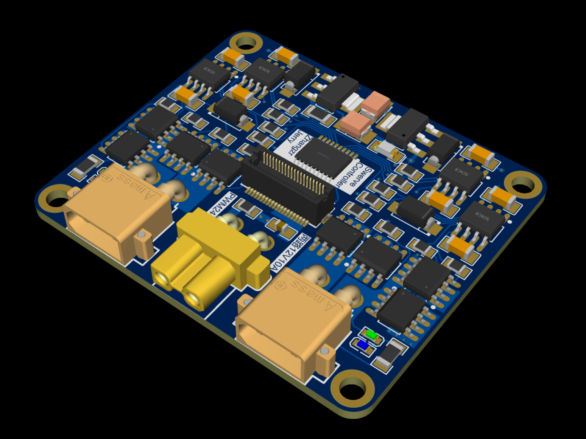
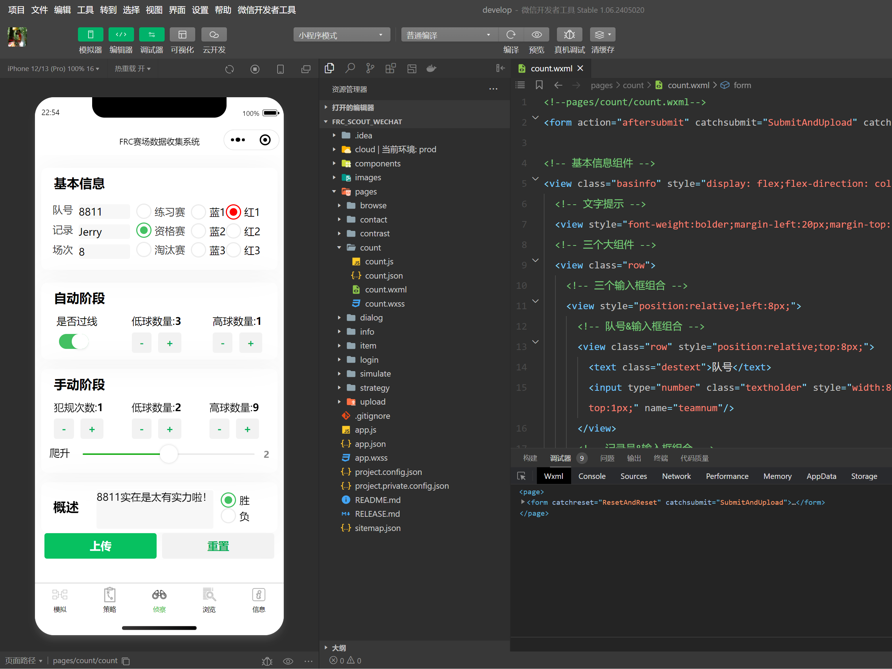
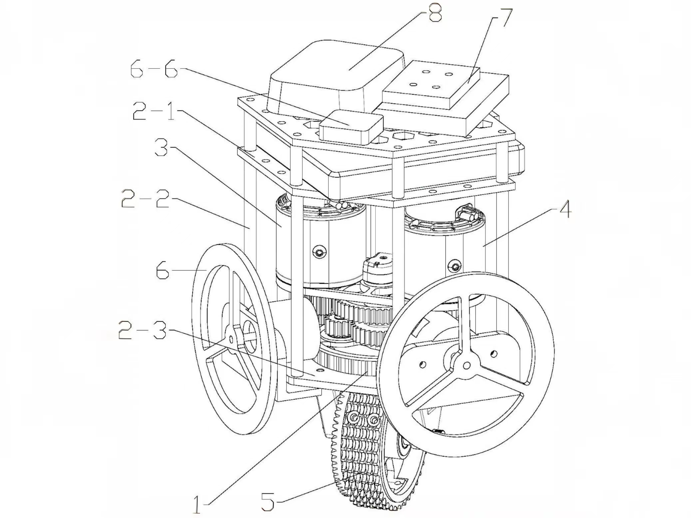
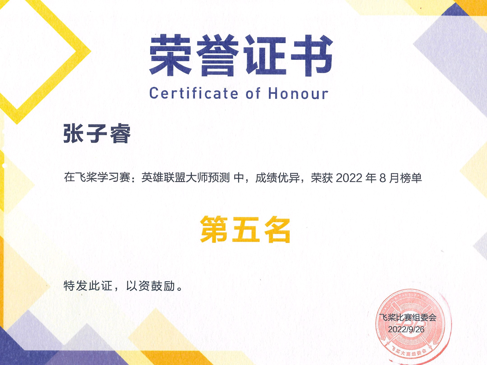
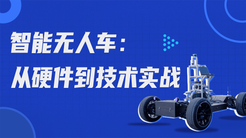
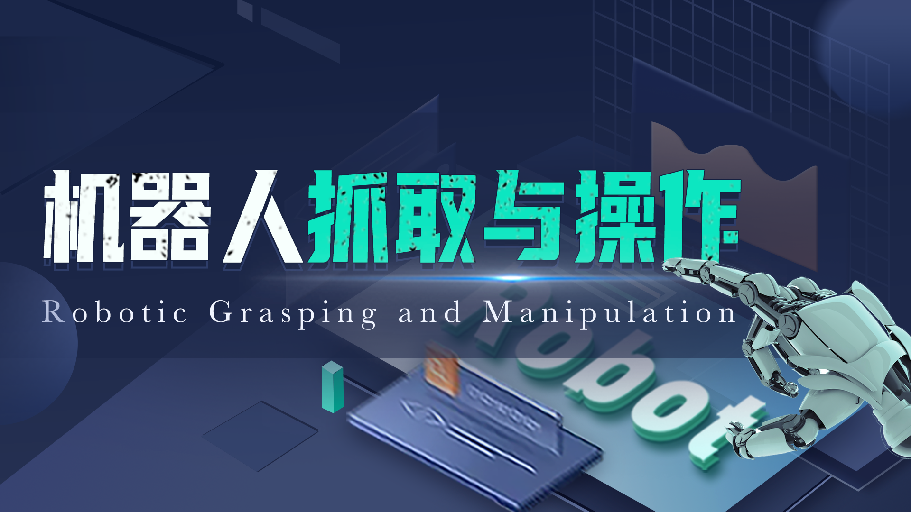
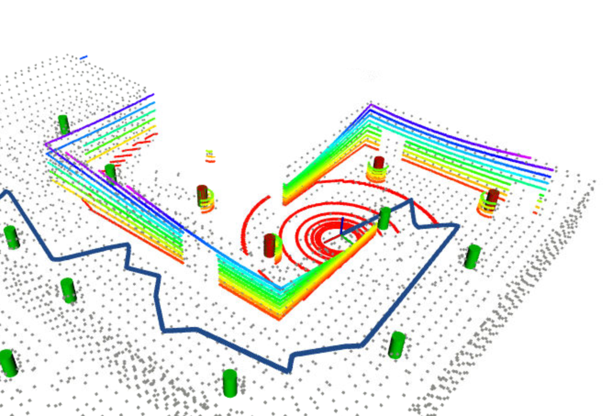
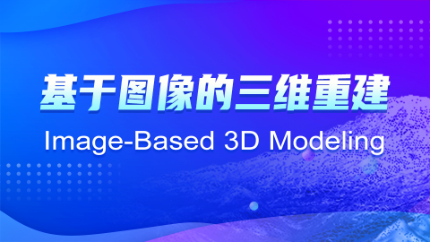
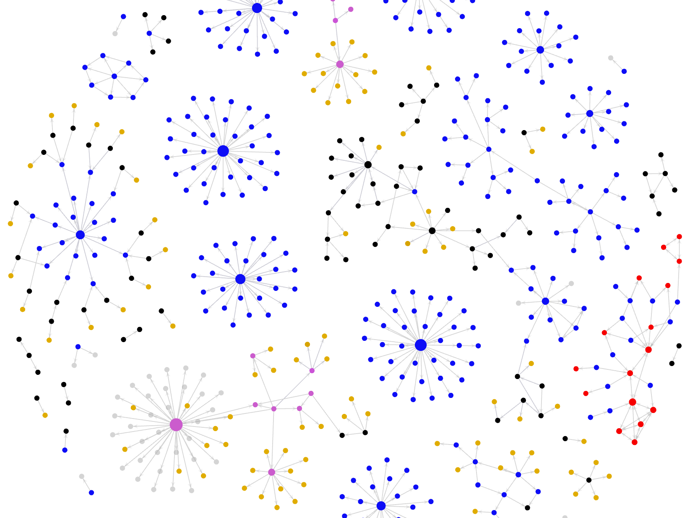

---
hide:
  - navigation
  - toc
---

# 

    

        <!-- 

            <h2>Academic Publications</h2>
        
 -->
        

            <h2>Personal Projects</h2>
            <!--

                

                    <b class="academic-subtitle">
                        Cyber Scouting
                    </b>
                    

                        FIRST Robotics Competition Team 8214
                    

                    

                        Sep. 2024 - Present
                    

                    

                    

                    

                        To Be Released
                    

                    

                        
                        
                    

                

                

                    
                

            
-->

                

                    <b class="academic-subtitle">
                        Intelligent Book Recommendation and User Interest Analysis System based on Factorization Machines⭐
                    </b>
                    

                        2023 Rhino-Bird Middle School Science Research Training Program 
                        Supervisor: Prof. Chuan Shi, Beijing University of Posts and Telecommunications
                    

                    

                        Jun. 2023 - Oct. 2023
                    

                    

                        <a href="https://cloud.tencent.com/developer/article/2258040">Background</a> /
                        <a href="https://github.com/ZhangzrJerry/RhinoBird">Code</a> /
                    

                    

                        The project aims to develop an intelligent book recommendation system based on DSSM to improve the accuracy and personalization of public library services.
                    

                    

                        
                        
                                
                    

                

                

                    
                

            

                

                    <b class="academic-subtitle">
                        Swerve Controller - Dual Motor Drive Board
                    </b>
                    

                        Zirui Zhang
                    

                    

                        Sep. 2022 - Oct. 2022
                    

                    

                        <a href="../img/projects/2022-controller-schematic.png">Schematic</a> /
                        <a href="../img/projects/2022-controller-top.png">Layout</a> /
                        <a href="../img/projects/2022-controller-bottom.png">Layout (bottom)</a> /
                    

                    

                        This drive board powers a swerve module with two independent motors: one for velocity, the other for steering, delivering a maximum power of 240W (2 * 12V * 10A).
                    

                    

                        
                        
                    

                

                

                    
                

            

                

                    <b class="academic-subtitle">
                        FRC Data Collection Software⭐
                    </b>
                    

                        <b>Zirui Zhang</b>, Yue Peng
                    

                    

                        Mar. 2022 - Aug. 2022
                    

                    

                        <a href="https://github.com/zhangzrjerry/frc_scouting">Code</a> /
                        <a href="../img/projects/frc-data-collection-software-gui.png">GUI</a> /
                    

                    

                        The wechat miniprogram provides a separate account for every team to collect, upload, browse, contrast, analyze, and export data during the FRC match.
                    

                    

                        
                        
                        
                        
                    

                

                

                    
                

            

                

                    <b class="academic-subtitle">
                        Balance Swerve - A Single-Wheeled Self-Balancing Omni-directional Mobile Platform
                    </b>
                    

                        Liangyu Cai, Zihan Chen, <b>Zirui Zhang</b>, Junyong Lin, Yingpei Chen, Yiyang Lu, Jiacheng Xiao, Suqing He 
                        Supervisor: Prof. Liang Chen, South China University of Technology
                    

                    

                        Sep. 2021 - Mar. 2022
                    

                    

                        <a href="https://patents.google.com/patent/CN115107901A">Patent</a> /
                    

                    

                        The platform is equipped with an omni-directional wheel, driven by a dual-motor system and a gear transmission assembly. A balancing mechanism ensures stability, while the omni-directional wheel enables omnidirectional movement and rapid steering.
                    

                    

                        
                        
                        
                        
                    

                

                

                    
                

            

        

        <!-- 

            <h2>Demos</h2>
            

                

                    <b class="academic-subtitle">
                        LOL Prediction - AI Studio Learning Competition
                    </b>
                    

                        Zirui Zhang
                    

                    

                        Jul. 2022 - Mar. 2023
                    

                    

                        <a href="https://aistudio.baidu.com/competition/detail/247">Background</a> /
                        <a href="https://github.com/zhangzrjerry/paddle-lolmp">Code</a> /
                    

                    

                        This project aims to solve the PaddlePaddle Learning Competition: League of Legends Master Prediction Challenge.
                    

                    

                        
                        
                        
                    

                

                

                    
                

            

        
 -->
    

        

            <h2>Course Projects</h2>
            

                

                    <b class="academic-subtitle">
                        Advanced Visual SLAM⭐
                    </b>
                    

                        Shenlan Xueyuan Offline Course 
                        Supervisor: Dr. Yijia He, Postdoc. Xiang Gao
                    

                    

                        Nov. 2024 - Dec. 2024
                    

                    

                        <a href="https://www.shenlanxueyuan.com/course/606">Background</a> /
                    

                    

                        To Be Released
                    

                    

                        
                    

                

                

                    
                

            

                

                    <b class="academic-subtitle">
                        Unmanned Autonomous Vehicles
                    </b>
                    

                        Shenlan Xueyuan Offline Course 
                        Supervisor: 
                    

                    

                        Oct. 2024 - Nov. 2024
                    

                    

                        <a href="https://www.shenlanxueyuan.com/course/729">Background</a> /
                    

                    

                        To Be Released
                    

                    

                        
                        
                    

                

                

                    
                

            

                

                    <b class="academic-subtitle">
                        Robotics Grasping and Manipulation
                    </b>
                    

                        Shenlan Xueyuan Online Course 
                        Supervisor: Dr. Wei Jing
                    

                    

                        Oct. 2024 - Dec. 2024
                    

                    

                        <a href="https://www.shenlanxueyuan.com/course/727">Background</a> /
                    

                    

                        To Be Released
                    

                    

                        
                    

                

                

                    
                

            

                

                    <b class="academic-subtitle">
                        Numerical Optimization in Robotics⭐
                    </b>
                    

                        Shenlan Xueyuan Online Course 
                        Supervisor: Prof. Fei Gao, Dr. Zhepei Wang
                    

                    

                        Oct. 2024 - Dec. 2024
                    

                    

                        <a href="https://www.shenlanxueyuan.com/course/726">Background</a> /
                    

                    

                        The course led by Professor Fei Gao and Doctor Zhepei Wang in ZJU Fast Lab, offers an in-depth exploration of Unconstrained Optimization (Quasi-Newton and Newton-CG), Constrained Optimization via Sequential Unconstrained Optimization (Penalty Method, Barrier Method, Lagrangian Relaxation), and Constrained Optimization (LDLP, LDQP, SOCP, PHR Augmented Lagrangian)
                    

                    

                        
                        
                    

                

                

                    
                

            

                

                    <b class="academic-subtitle">
                        Introduction to Mobile Robotics⭐
                    </b>
                    

                        The Hong Kong University of Science and Technology ELEC 3210 
                        Supervisor: Prof. Shaojie Shen, Mphil. Yang Xu
                    

                    

                        Sep. 2024 - Nov. 2024
                    

                    

                        <a href="https://seng.hkust.edu.hk/sites/default/files/IMCE/UG/Course%20Syllabus/Fall%202024-2025/ELEC%203210_Fall%202024-25.pdf">Background</a> /
                        <a href="https://github.com/ZhangzrJerry/Introduction-to-Mobile-Robotics">Code</a> /
                        <a href="/blog/2024/10/21/ekf-slam-%E8%B0%83%E5%8F%82%E5%B0%8F%E8%AE%B0/"> Blog: EKF SLAM</a> /
                    

                    

                        There are three main projects through the course: Iterative Closest Points (ICP) Odometry, Extended Kalman Filter Simultaneous Localization and Mapping (EKF SLAM), and Path Planning (A Star), which cover the basic algorithms of mobile robotics.
                    

                    

                        
                        
                        
                    

                

                

                    
                

            

                

                    <b class="academic-subtitle">
                        Image-Based 3D Modeling
                    </b>
                    

                        Shenlan Xueyuan Online Course 
                        Supervisor: Prof. Peng Lu, Dr. Tang Sui
                    

                    

                        Dec. 2023 - Feb. 2024
                    

                    

                        <a href="https://www.shenlanxueyuan.com/course/654">Background</a> /
                    

                    

                        The course provided by Professor Peng Lu, offers an in-depth exploration of Structured From Motrion algorithm, Dense Point Cloud Reconstruction, and Surface Reconstruction.
                    

                    

                        
                        
                    

                

                

                    
                

            

                

                    <b class="academic-subtitle">
                        Knowledge Graph Construction based on Big Data Technology
                    </b>
                    

                        2021 Guangzhou Yingcai Middle School Science Research Training Program 
                        Supervisor: Prof. Yi Cai, South China University of Technology
                    

                    

                        Jan. 2022 - Aug. 2022
                    

                    

                        <a href="http://jyj.gz.gov.cn/gk/zfxxgkml/qt/gs/qt/content/post_7980438.html">Background</a> /
                    

                    

                        This project was delivered by the 2021 Guangzhou Yingcai Middle School Science Research Training Program and Professor Yi Cai in SCUT.
                    

                    

                        
                    

                

                

                    
                

            

        

            <h2>Robotics Competition</h2>
            

                

                    <b class="academic-subtitle">
                        FRC 2024 Robot - Defiant⭐
                    </b>
                    

                        FIRST Robotics Competition Team 6399 (9975)
                    

                    

                        Jun. 2024 - Aug. 2024
                    

                    

                        <a href="https://www.youtube.com/watch?v=9keeDyFxzY4">Background</a> /
                        <a href="https://www.bilibili.com/video/BV1pbWCejEUi">Recap</a> /
                    

                    

                        For FRC 2024 game rules, the mission of the robot is to collect the note and shoot to the speaker or to the amp.
                    

                    

                        
                        
                        
                    

                

                

                    
                

            

                

                    <b class="academic-subtitle">
                        FRC 2023 Robot - Yuan Bot⭐
                    </b>
                    

                        FIRST Robotics Competition Team 8811
                    

                    

                        Jan. 2022 - Aug. 2023
                    

                    

                        <a href="https://www.youtube.com/watch?v=LgniEjI9cCM">Background</a> /
                        <a href="https://www.bilibili.com/video/BV1RW4y1M72Y">Recap</a> /
                    

                    

                        For 2023 FRC Off-season China game rules, the mission of the robot is to collect and shoot the balls to the hub.
                    

                    

                        
                        
                        
                    

                

                

                    
                

            

                

                    <b class="academic-subtitle">
                        FRC 2022 Robot - Kylin
                    </b>
                    

                        FIRST Robotics Competition Team 8011
                    

                    

                        *. 2022
                    

                    

                        <a href="https://www.youtube.com/watch?v=LgniEjI9cCM">Background</a> /
                    

                    

                        For FRC 2022 game rules, the mission of the robot is to collect and shoot the balls to the hub.
                    

                    

                        
                        
                        
                    

                

                

                    
                

            

                

                    <b class="academic-subtitle">
                        FRC 2021 Robot - Kylin⭐
                    </b>
                    

                        FIRST Robotics Competition Team 8011
                    

                    

                        *. 2021
                    

                    

                        <a href="https://www.youtube.com/watch?v=I77Dz9pfds4">Background</a> /
                        <a href="https://www.bilibili.com/video/BV1WQ4y1z7DM">Recap</a> /
                    

                    

                        For FRC 2021 game rules, the mission of the robot is to collect the power cell and shoot to the power port.
                    

                    

                        
                        
                        
                    

                

                

                    
                

            

                

                    <b class="academic-subtitle">
                        FRC 2020 Robot - Kylin
                    </b>
                    

                        FIRST Robotics Competition Team 8011
                    

                    

                        *. 2020
                    

                    

                        <a href="https://www.youtube.com/watch?v=gmiYWTmFRVE">Background</a> /
                    

                    

                        For FRC 2020 game rules, the mission of the robot is to collect the power cell and shoot to the power port.
                    

                    

                        
                        
                        
                    

                

                

                    
                

            

        

    

