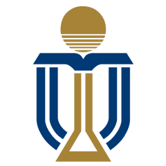
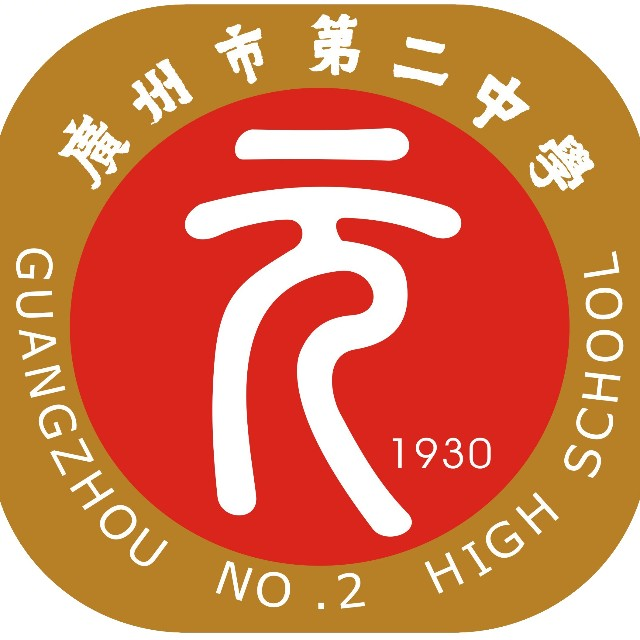
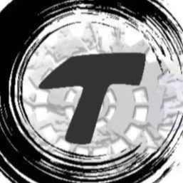
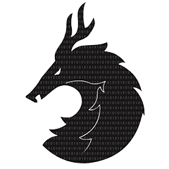

---
hide:
  - navigation
  - toc
---

# 

    <h2>
        <b>
        Zirui ZHANG
        </b>&nbsp
        
    </h2>

## Education

    

        

            

                <a href="https://hkust.edu.hk/"></img></a>
            

            

                <b> The Hong Kong University of Science and Technology </b>
                  BEng
            

            

                <b> Hong Kong, China </b>
                  Sep. 2024 - Jun. 2028
            
    
        

        

        

    

        

            

                <a href="https://www.gdgzez.com.cn/"></img></a>
            

            

                <b> Guangzhou No.2 High School </b>
                  Senior Secondary School
            

            

                <b> Guangzhou, China </b>
                  Sep. 2021 - Jun. 2024
            

        

        

        

    

## Experience

   

        

            

                <a href="https://nifornextinnovation.com/"></img></a>
            

            

                <b> Next Innovation STEM Center </b>
                  Robotics Engineer
            

            

                <b> Guangzhou, China </b>
                  Sep. 2024 - Present
            

        

        

        

    

        

            

                <a href="https://ur.tencent.com/"></img></a>
            

            

                <b> Rhino-Bird Middle School Science Research Training Program </b>
                  Research Intern
            

            

                <b> Remote </b>
                  Jun. 2023 - Oct. 2023
            

        

        

            <ul>
                <li>Supervised by Professor Chuan Shi from BUPT</li>
                <li>Developed an intelligent book recommendation system to improve the accuracy of public library services</li>
                <li>Won the Excellent Award in 2023 Rhino-Bird Middle School Science Research Training Program</li>
            </ul>
        

    

        

            

                <a href="https://jyj.gz.gov.cn/gkmlpt/content/7/7875/post_7875383.html"></img></a>
            

            

                <b> Guangzhou Yingcai Middle School Science Research Training Camp </b>
                  Research Trainee
            

            

                <b> Guangzhou, China </b>
                  Jan. 2022 - Aug. 2022
            

        

        

            <ul>
                <li>Supervised by Professor Yi Cai from SCUT</li>
                <li>Focused on the construction of knowledge graph</li>
            </ul>
        

    

## Involvement

    

        

            

                <a href="https://www.thebluealliance.com/team/8214"></img></a>
            

            

                <b> FIRST Robotics Competition Team 8214 </b>
                  Program Mentor
            

            

                <b> Guangzhou, China </b>
                  Sep. 2024 - Present
            

        

        

            <ul>
                <li>Responsible for the development of the FRC robotics control system</li>
            </ul>
        

    

    

        

            

                <a href="https://www.thebluealliance.com/team/6399"></img></a>
            

            

                <b> FIRST Robotics Competition Team 6399 </b>
                  Program Mentor
            

            

                <b> Jinan, China </b>
                  Jul. 2024 - Aug. 2024
            

        

        

            <ul>
                <li>Responsible for the development of the FRC robotics control system and provided programming instruction to the team</li>
                <li>Led the team to <b>Engineering Inspiration Award</b> in the WRCC 2024 - Beijing FRC Program China Off-season Event</li>
            </ul>
        

    

    

        

            

                <a href="https://www.thebluealliance.com/team/8811"></img></a>
            

            

                <b> FIRST Robotics Competition Team 8811 </b>
                  Founder, Youth Mentor, Team Captain
            

            

                <b> Guangzhou, China </b>
                  Sep. 2021 - Aug. 2023
            

        

        

            <ul>
                <li>Established the team in my senior high school and <b>raised over $14,000</b> in the first year</li>
                <li>Conducted over 60 weekly studies and 3 holiday training programs for our team in 2 years</li>
                <li>Led the team to the <b>3rd Prize</b> in 2023 FRC Off-season China</li>
            </ul>
        

    

    

        

            

                <a href="https://www.thebluealliance.com/team/8011"></img></a>
            

            

                <b> FIRST Robotics Competition Team 8011 </b>
                  Team Captain, Program Leader
            

            

                <b> Guangzhou, China </b>
                  Sep. 2019 - Jun. 2023
            

        

        

            <ul>
                <li>Led the team to the <b>Champion</b> in the 2020 We RoboStar Robotics League as the Program Leader</li>
                <li>Steered the team to <b>Rookie Game Changer Award</b> in the 2021 INFINITE RECHARGE At Home Challenge as team captain</li>
                <li>Won the <b>Excellence in Engineering Award</b> with my teamates in 2022 Hangzhou Regional</li>
            </ul>
        

    

## Honors and Awards

    <ul>
        <li>
            <b>Engineering Inspiration Award</b>;
            World Robot Contest Championships 2024 - Beijing FRC Program China Offseason Event
        </li>
        <li>
            <b>Excellent Award</b>;
            2023 Tencent Rhino-Bird Middle School Science Research Training Program
        </li>
        <li>
            <b>3rd Prize</b>;
            2023 Indiemicro Robotics Competition Exchange Event
        </li>
        <li>
            <b>Excellence in Engineering Award</b>;
            2022 FIRST Robotics Competition Hangzhou Regional
        </li>
        <li>
            <b>2nd Prize</b>;
            The 8th National Youth Science Popularization Innovation Experiment and Works Competition (2022)
        </li>
        <li>
            <b>Excellent Award</b>;
            The 8th China International College Students' "Internet+" Innovation and Entrepreneurship Competition, Seed Track, Guangdong Division (2022)
        </li>
        <li>
            <b>Rookie Game Changer Award</b>;
            INFINITE RECHARGE At Home Challenge 2021
        </li>
        <li>
            <b>Champion</b>;
            2020 WE RoboStar Robotics League
        </li>
    </ul>

