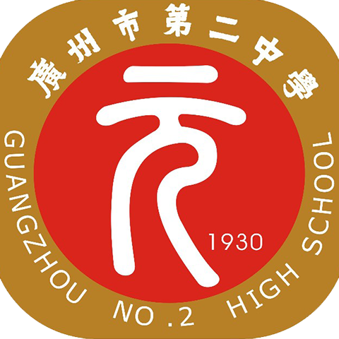
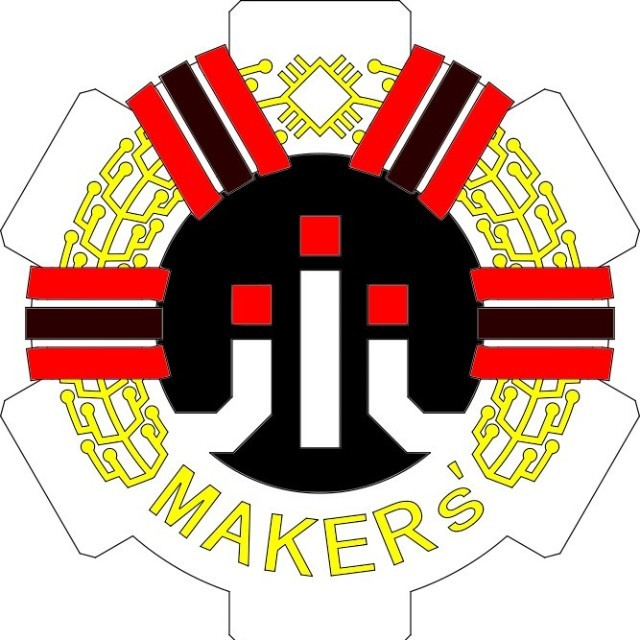
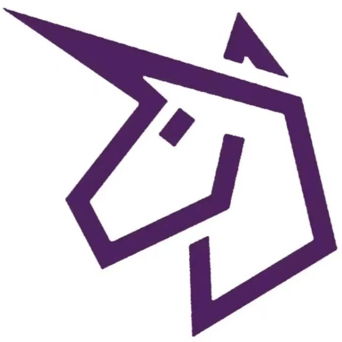
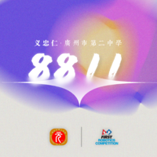
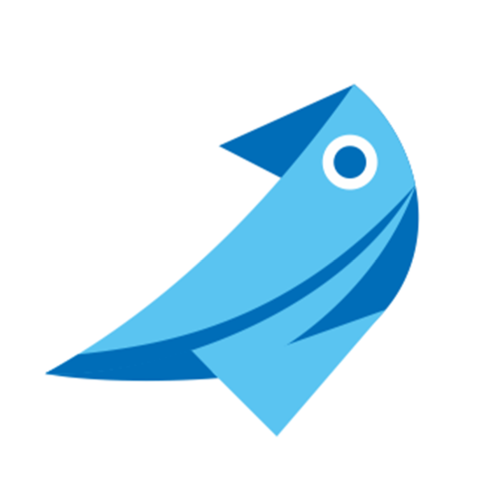

---
hide:
  - navigation
  - toc
---

# Resume

    <h2>
        <b>
        Zirui ZHANG
        </b>
    </h2>

## Education

    

        

            

                </img>
            

            

                <b> The Hong Kong University of Science and Technology </b>
                  BEng
            

            

                <b> Hong Kong, China </b>
                  Sep. 2024 - Jun. 2028
            
    
        

        

            <ul>
                <li>
                    CGA: --/4.3
                    <a href="./hkust">[Details]</a>
                </li>
                <li class="resume-corec">
                    

                        Core Courses: 
                        

                            </img>
                        

                    

                        

                            

                                <b>Mathematics</b>
                                

                                    1. Numerical Optimization in Robotics* 
                                

                            

                            

                                <b>Robotics</b>
                                

                                    1. System Model, Analysis and Control (<b>-</b>) 
                                    2. Introduction to Mobile Robotics (<b>au</b>2) 
                                    3. Robotics Grasping and Manipulation* 
                                

                            

                            

                                <b>Algorithms</b>
                                

                                    <!-- 1. Image-based 3D Modeling*  不记得了 高中学的了 -->
                                    1. Design and Analysis of Algorithm (<b>AU</b>1) 
                                

                            

                        

                        

                        

                            1. <i>audit</i> 
                            2. <i>audit without enrolling via system</i> 
                            *. <i>shenlan xueyuan course</i> <a href="/projects/#course-projects">[details]</a> 
                        

                    

                </li>
            </ul>
            <!-- You are an Asian, not a Bsian! -->
        

    

    

        

            

                </img>
            

            

                <b> Guangzhou No.2 High School </b>
                  Senior Secondary School
            

            

                <b> Guangzhou, China </b>
                  Sep. 2021 - Jun. 2024
            

        

        

            <!-- <ul>
                <li>
                    CNCEE: 658/750 (Gaokao)
                    <a href="./gdgzez">[Details]</a>
                </li>
            </ul> -->
        

    

## Professional Experience

   

        

            

                </img>
            

            

                <b> Next Innovation </b>
                  Part Time; Robotics Engineer, Program Mentor
            

            

                <b> Guangzhou, China </b>
                  Sep. 2024 - Present
            

        

        

        

    

    <!-- 

        

            

                </img>
            

            

                <b> MakerX Technology Co., Ltd. </b>
                  Startup, Control Systems Engineer
            

            

                <b> Guangzhou, China </b>
                  Aug. 2024 - Aug. 2024
            

        

        

            <ul>
                <li>Established the very company that focused on technology and innovation about robots.</li>
            </ul>
        

    
 -->

## Community Involvement

    <!-- 

        

            

                </img>
            

            

                <b> FIRST Robotics Competition Team 10183 </b>
                  Remote Mentor
            

            

                <b> Las Vegas, NV </b>
                  Sep. 2024 - Present
            

        

        

            <ul>
            </ul>
        

    
 -->
    

        

            

                </img>
            

            

                <b> FIRST Robotics Competition Team 8214 </b>
                  Program Mentor
            

            

                <b> Guangzhou, China </b>
                  Sep. 2024 - Present
            

        

        

            <ul>
            </ul>
        

    

    

        

            

                </img>
            

            

                <b> FIRST Robotics Competition Team 6399 </b>
                  Program Mentor
            

            

                <b> Jinan, China </b>
                  Jul. 2024 - Aug. 2024
            

        

        

            <ul>
                <li>
                Responsible for the development of the FRC robotics control system, provided programming instruction to the team, and successfully led the team to <a href="/projects/#2024-defiant" style="color:black;"><b>Engineering Inspiration Award</b></a> in the World Robot Contest Championships 2024 - Beijing FRC Program China Offseason Event. (Off-Season Demo Team Number: 9975)
                </li>
            </ul>
        

    

    

        

            

                </img>
            

            

                <b> FIRST Robotics Competition Team 8811 </b>
                  Founder, Youth Mentor, Team Captain
            

            

                <b> Guangzhou, China </b>
                  Sep. 2021 - Aug. 2023
            

        

        

            <ul>
                <li>
                Established the team in my senior high school, <b>raised over $14,000</b> by contacting FIRST, my senior high school, and five technological companies.
                </li>
                <li>
                Conducted over 60 weekly studies and 3 holiday training programs for our team and finally won the <a href="/projects/#2023-yuan" style="color:black;"><b>3rd Prize</b></a> in 2023 FRC Off-season China. 
                </li>
            </ul>
        

    

    

        

            

                </img>
            

            

                <b> FIRST Robotics Competition Team 8011 </b>
                  Team Captain, Program Leader
            

            

                <b> Guangzhou, China </b>
                  Sep. 2019 - Jun. 2023
            

        

        

            <ul>
                <li>Led the team to <a href="/projects/#2020-kylin" style="color:black;"><b>Championship</b></a> in the 2020 We RoboStar League as the Program Leader and simultaneously managed the team's Engineering Journal.
                </li>
                <li>
                As team captain, steered the team to <a href="/projects/#2021-kylin" style="color:black;"><b>Rookie Game Changer Award</b></a> in the 2021 INFINITE RECHARGE At Home Challenge and Rank 18 in the 2021 Robotics Championship China.
                </li>
                <li>
                Won <a href="/projects/#2022-kylin" style="color:black;"><b>Excellence in Engineering Award</b></a> with my teamates in 2022 Hangzhou Regional.
                </li>
            </ul>
        

    

## Research Projects

    <!--

        

            

                </img>
            

            

                <b> Shenlan Xueyuan Offline Practice Program </b>
                  Practice Program;
            

            

                <b> Huzhou, China </b>
                  Nov. 2024
            

        

        

            <ul>
                <li>
                Unmanned Autonomous Vehicles, Huzhou Institute of Zhejiang University
                </li>
            </ul>
        

    
-->

        

            

                </img>
            

            

                <b> Rhino-Bird Middle School Science Research Training Program </b>
                  Research Program;
            

            

                <b> Guangzhou, China </b>
                  Jun. 2023 - Oct. 2023
            

        

        

            <ul>
                <li>
                Mainly took part in model training and backend database developing.
Community Involvement, and my project "<a href="/projects/#2023-rhinobird" style="color:black;"><b>Intelligent Book Recommendation and User Interest Analysis System Based on Factorization Machines</b></a>" won the 2023 Excellent Award
                </li>
            </ul>
        

    

## Honors and Awards

    <ul>
        <li>
            <b>Engineering Inspiration Award</b>;
            World Robot Contest Championships 2024 - Beijing FRC Program China Offseason Event
        </li>
        <li>
            <b>Excellent Award</b>;
            2023 Tencent Rhino-Bird Middle School Science Research Training Program
        </li>
        <li>
            <b>3rd Prize</b>;
            2023 Indiemicro Robotics Competition Exchange Event
        </li>
        <li>
            <b>Excellence in Engineering Award</b>;
            2022 FIRST Robotics Competition Hangzhou Regional
        </li>
        <li>
            <b>2nd Prize</b>;
            The 8th National Youth Science Popularization Innovation Experiment and Works Competition (2022)
        </li>
        <li>
            <b>Excellent Award</b>;
            The 8th China International College Students' "Internet+" Innovation and Entrepreneurship Competition, Seed Track, Guangdong Division (2022)
        </li>
        <li>
            <b>Rookie Game Changer Award</b>;
            INFINITE RECHARGE At Home Challenge 2021
        </li>
        <li>
            <b>Champion</b>;
            2020 WE RoboStar Youth Robotics League
        </li>
    </ul>

